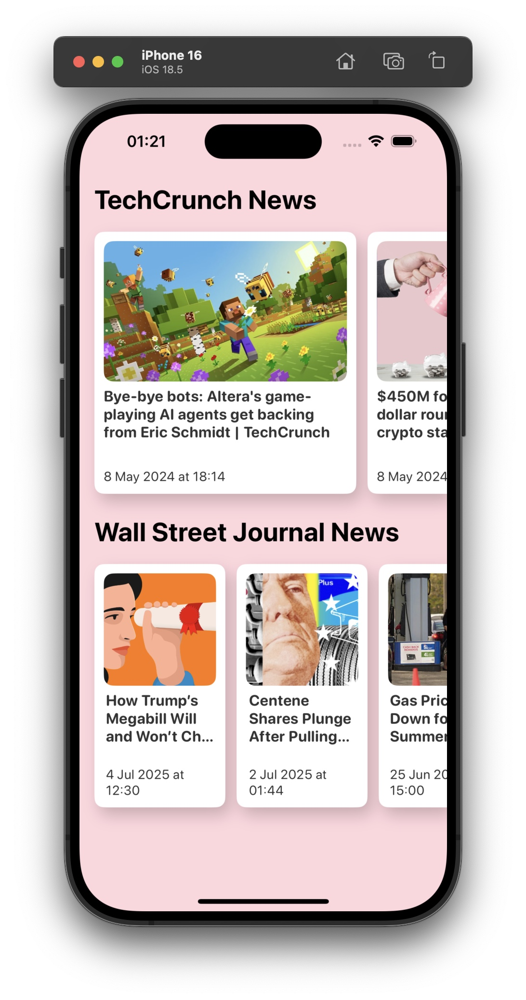
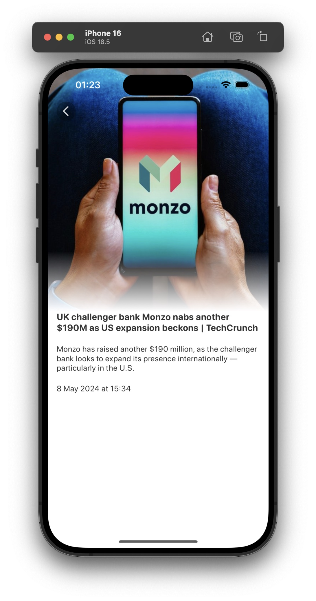

# NewsApp

Простое iOS-приложение для отображения новостей.

## 🛠 Стек
- Swift 5, SwiftUI
- MVVM архитектура
- Асинхронные запросы (URLSession)
- Работа с реальным API (NewsAPI)
- Чистый код, модульная структура

## 📸 Скриншоты

<table>
<tr>
<td></td>
<td></td>
</tr>
</table>
